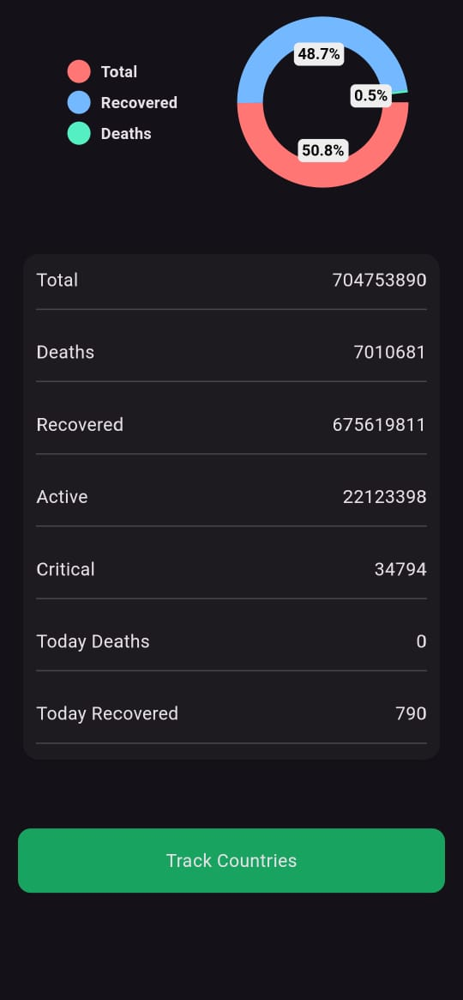
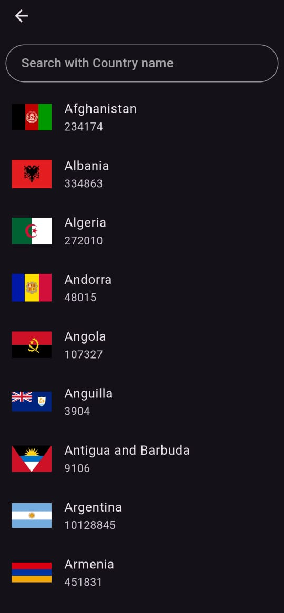
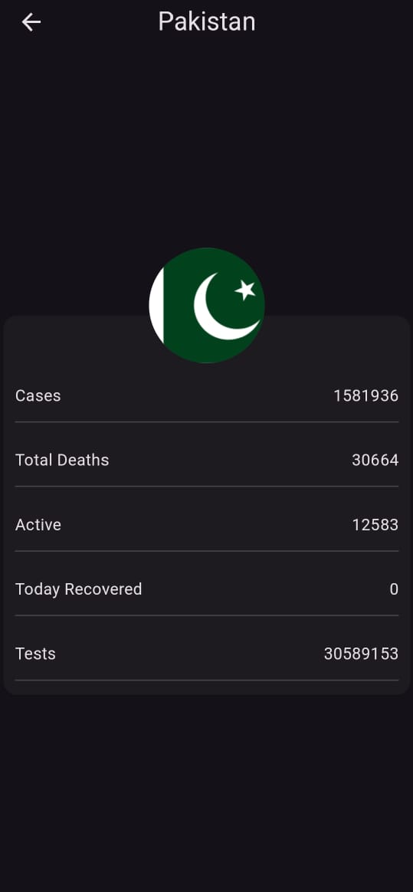

# 🦠 Corona Tracker App

  

The **Corona Tracker App** is a Flutter-based mobile application that provides real-time updates on COVID-19 cases globally and locally. Stay informed with the latest statistics, news, and health guidelines to keep yourself and others safe.

## 🚀 Features

- 🌍 **Global Statistics**: Access real-time COVID-19 data from around the world.
- 📊 **Country-wise Data**: Drill down into statistics by country.
- 📰 **News Updates**: Get the latest news and developments on the pandemic.
- 🦠 **Health Guidelines**: Learn about the precautionary measures to stay safe.

## 📱 Screenshots

| Home Screen | Global Statistics | Country-wise Data |
|:-----------:|:-----------------:|:-----------------:|
|  |  |  |

## 📦 Installation

Follow these steps to get started with the Corona Tracker App:

1. **Clone the repository**:
   https://github.com/huzaifaAhmad9/Corona-Tracker-App.git

2. **Navigate to the project directory**:
   cd corona-tracker-app

3. **Install the required dependencies**:
   flutter pub get

4. **Run the app**:
   flutter run

## 🛠 Built With

- **Flutter** - A UI toolkit for building natively compiled applications for mobile from a single codebase.
- **Dart** - Programming language optimized for building mobile, desktop, server, and web applications.
- **REST API** - For fetching real-time COVID-19 data.
- **Provider** - A state management tool to manage the app's state efficiently.

## 🧑‍💻 Contributing

We welcome contributions to enhance the Corona Tracker App. To contribute, follow these steps:
- Fork the repository.
- Create a new branch (git checkout -b feature/YourFeature).
- Commit your changes (git commit -m 'Add some feature').
- Push to the branch (git push origin feature/YourFeature).
- Open a pull request.

## 👤 Contact

Feel free to reach out if you have any questions or suggestions:

- **Email**: huzaifaahmad4001@gmail.com
